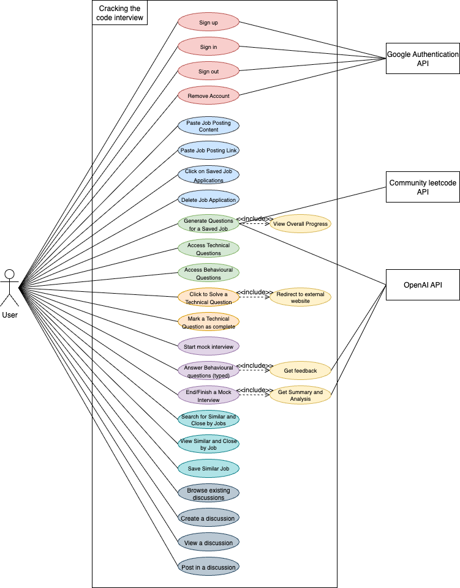

# Requirements and Design

## 1. Change History

| **Change Date**   | **Modified Sections** | **Rationale** |
| ----------------- | --------------------- | ------------- |
| _Nothing to show_ |

---

## 2. Project Description

Struggling to find relevant interview questions is a thing of the past. Our AI-powered platform tackles this by taking your uploaded job descriptions and generating a highly tailored set of practice materials. This includes role-specific coding challenges, system design problems, and behavioral interview questions. To ensure you're interview-ready, you can input and track your progress against these personalized lists using the progress tracker, and refine your soft skills with the mock interview, which provides instant feedback to hone your behavioural question delivery.

This comprehensive tool extends beyond just preparation by helping users discover new opportunities and build community. Based on the initial job information provided, the platform intelligently suggests comparable roles, broadening the user's career search and expanding their practice scope. Furthermore, users can engage in peer-to-peer learning by creating or joining discussion groups, allowing them to share recent interview experiences, discuss preparation strategies, and exchange insights with others pursuing similar roles. This integrated approach ensures a personalized, efficient, and collaborative journey toward securing their desired position.

---

## 3. Requirements Specification

### **3.1. List of Features**

#### 1. Authentication
To access app features, a user must Sign In using Google Authentication Service first. New users should Sign Up before Signing In. An authenticated user can Sign Out. Users can also delete their account from the app’s database.

#### 2. Manage job applications
This feature allows users to build a personalized portfolio of job opportunities they're interested in. Users have two options for adding job postings: they can either paste the job posting content directly (copying and pasting the job description text into a text field) or paste a link to the job posting from career websites.

The system stores and organizes these job applications as a searchable, clickable list where each entry displays the job title and company name. Users can view all their saved job applications in this centralized list and must click on a specific job application to use it for generating interview questions. 

#### 3. Generate questions
For each job application, the user can request relevant coding and behavioral questions. Upon request, the app gathers a curated set of interview questions by leveraging a community LeetCode API to gather coding and system design questions tailored to the job description and OpenAI for behavioral questions. The app then displays two options: Technical Questions and Behavioral Questions, which the user can choose from.

Additionally, the app automatically tracks and displays the user's completion progress across all generated questions, allowing them to monitor their overall preparation status for that specific job application.

#### 4. Solving technical questions
If the user selects Technical Questions, the app displays a list of relevant coding and system design questions. When the user taps on a question, they are redirected to the appropriate external platform (e.g., LeetCode, HackerRank) where they can practice and solve the problem in a real coding environment. After solving the questions, the user can mark the question as completed which increments their overall progress tracker.

#### 5. Mock Interviews
If the user selects Behavioural Questions, the app displays a list of behavioural questions. A user can start a mock interview session for behavioral questions. When the user taps the "Start Mock Interview" button, the app redirects them to a dedicated mock interview screen where the behavioral questions are displayed.

The user can type their answer to each behavioral question. After submitting an answer, the app uses the OpenAI API to analyze the response and provide detailed feedback, then it automatically marks the question as complete.

The user can then end the mock interview or proceed through all the behavioral questions in the mock interview session. Once the session is complete, the app uses the OpenAI API to generate a summary of the user's performance, including feedback for each question and an overall assessment of their responses.

#### 6. Find similar jobs
For each job application, the user can search for similar job postings. Upon request, the app searches for job positions with the same or similar titles currently available on the market. The app then calculates the distance between each job location and the user's location to filter for nearby opportunities, as well as identifies remote positions.

The app displays a curated list of similar job postings. When the user taps on a job posting, the app displays the full job details, including the company name, job description, location, and a link to apply. The user can then choose to save the job posting to their job applications.

#### 7. Manage discussions
A user can create a discussion and provide the discussion topic (e.g., "Amazon SDE Interview" or "Google Behavioral Tips").

Any user can browse a list of active discussions and find discussions relevant to their job search. They will be able to view all discussion chats. Users can post messages to share their interview experiences, ask questions, and engage with others who have applied to similar positions or companies.

### **3.2. Use Case Diagram**

### **3.3. Actors Description**
*   **User (Candidate):** The primary actor who uses the platform to manage job applications, generate tailored interview questions, practice technical and behavioral answers, and participate in discussions.
    
*   **OpenAI API:** External service responsible for generating behavioral interview questions and providing feedback on user responses in mock interviews.
    
*   **Community LeetCode API:** External service that supplies technical coding and system design questions relevant to specific job postings.
    
*   **Job Search API:** External service used to search and fetch similar job postings from the internet.
    
*   **Discussion Participants (Peers):** Other authenticated users who join and contribute to discussion groups by sharing interview experiences and insights.

### **3.4. Use Case Description**
**Feature 1: Authentication**

*   **Sign Up:** A new user authenticates via Google OAuth; the system creates a linked account record.
    
*   **Sign In:** The user signs in with Google OAuth and gains access to protected features.
    
*   **Sign Out:** The user ends the current authenticated session.
    
*   **Remove Account:** The user requests deletion; the system permanently removes their data.
    

**Feature 2: Manage Job Applications**

*   **Paste job posting:** The user pastes JD text; the system stores title, company, and description.
    
*   **Paste job posting link:** The user saves a URL; the system fetches and normalizes the JD.
    
*   **Click saved job applications:** The user opens a job to drive generation and practice flows.
    
*   **Delete job application:** The user removes an existing job from their portfolio.
    

**Feature 3: Generate Questions**

*   **Generate questions for a saved job:** The system produces behavioral (OpenAI) and technical (LeetCode) sets for the selected job.
    
*   **View overall progress:** The system shows completion status across generated questions.
    
*   **Access Technical Questions:** The user opens the technical set for that job.
    
*   **Access Behavioral Questions:** The user opens the behavioral set for that job.
    

**Feature 4: Solving Technical Questions**

*   **Click to solve a Technical Question:** The user selects a problem to practice.
    
*   **Redirect to external website:** The system opens the problem on its host platform.
    
*   **Mark a technical question as complete:** The user marks it done; progress updates.
    

**Feature 5: Mock Interviews**

*   **Start mock interview:** The user starts a behavioral session for the selected job.
    
*   **Answer behavioral question:** The user types an answer into the response box.
    
*   **Get feedback:** The system analyzes the answer via OpenAI and returns feedback.
    
*   **End/Finish a mock interview:** The user ends the session.
    
*   **Get summary and analysis:** The system compiles per-question feedback and an overall summary.
    

**Feature 6: Find Similar Jobs**

*   **Search for similar and close-by jobs:** The system queries external job sites and filters by remote/nearby.
    
*   **View a similar job:** The user opens a posting to read details and apply link.
    
*   **Save a similar job:** The user adds a posting into their portfolio.
    

**Feature 7: Manage Discussions**

*   **Browse existing discussions:** The user views/searches topic rooms.
    
*   **Create a discussion:** The user creates a new topic room with an initial message.
    
*   **View a discussion:** The user opens a room to read its messages.
    
*   **Post in a discussion:** The user submits a message to the room.

  
### **3.5. Formal Use Case Specifications (5 Most Major Use Cases)**

#### Use Case 1: Generate Questions for a Saved Job 

**Description**: User generates tailored interview questions (behavioral and technical) for a specific saved job application using external APIs.

**Primary actor(s)**: User

**Secondar actor(s)**: OpenAI API, Community LeetCode API

**Preconditions:** 
- User is authenticated and logged into the system
- User has at least one saved job application in their portfolio

**Post-conditions:** 
- User can access tailored behavioral and coding questions for the selected job application
- Questions are stored and available for future practice sessions
- Progress tracking is initialized for the generated questions
    
**Main success scenario**:
1. User navigates to their job applications list
2. User selects one of their saved job applications
3. User clicks on "Generate Questions" button
4. System extracts job description and requirements from the selected application
5. System calls OpenAI API to generate behavioral questions based on job description
6. System calls Community LeetCode API to gather relevant coding questions based on job title and requirements
7. System processes and stores the generated questions
8. System displays two options: "Behavioral Questions" and "Technical Questions" buttons
9. User can click either button to view the respective list of generated questions

**Failure scenario(s)**:
- 1a. Job applications list fails to load:
    - System displays error message: "Unable to load job applications. Please check your connection and try again."

- 2a. No saved job applications available:
    - System displays message: "No job applications found. Please add a job application first."
    - System provides option to "Add Job Application"

- 2b. Selected job application cannot be accessed:
    - System displays error message: "Selected job application is no longer available or corrupted."

- 3a. Generate Questions button is unresponsive:
    - System displays error message: "Service temporarily unavailable. Please try again shortly."

- 4a. No job description content available:
    - System displays error message: "Unable to generate questions. Job description is missing or incomplete. Please edit the job application and add job description content."

- 4b. Job description extraction fails:
    - System displays error message: "Unable to process job description. Please try again or contact support."

- 5a. OpenAI API failure:
    - System displays error message: "Unable to generate behavioral questions at this time."
    - System continues to step 6 to attempt coding questions generation
    - If coding questions are successfully generated, system displays only "Technical Questions" button
    - If both APIs fail, no buttons are displayed and use case terminates unsuccessfully

- 5b. OpenAI API returns no behavioral questions:
    - System displays warning: "No behavioral questions could be generated for this job type."
    - System continues to step 6 to attempt coding questions generation
    - If coding questions are successfully generated, system displays only "Technical Questions" button
    - If no coding questions are generated either, no buttons are displayed and use case terminates unsuccessfully

- 6a. Community LeetCode API failure:
    - System displays error message: "Unable to generate coding questions at this time."
    - If behavioral questions were successfully generated, system displays only "Behavioral Questions" button
    - If both APIs fail, no buttons are displayed and use case terminates unsuccessfully

- 6b. LeetCode API returns no coding questions:
    - System displays warning: "No relevant coding questions found for this job type."
    - If behavioral questions were successfully generated, system displays only "Behavioral Questions" button
    - If no behavioral questions were generated either, no buttons are displayed and use case terminates unsuccessfully

- 7a. Question processing failure:
    - System displays error message: "Questions generated but could not be processed. Please try again."

- 7b. Question storage failure:
    - System displays error message: "Questions generated but could not be saved. Please try again."

- 8a. UI rendering failure:
    - System displays error message: "Interface error occurred. Please refresh and try again."

- 9a. Button interaction failure:
    - System displays error message: "Unable to load questions. Please try generating questions again."
    - Use case returns to step 3

#### Use Case 2: Start Mock Interview Session  

**Description**: The user begins a mock interview session and the system loads behavioral questions.  

**Primary actor(s)**: User  

**Secondary actor(s)**: OpenAI API  

**Preconditions:**  
- User is authenticated and logged in.  
- User has generated behavioral questions for at least one job.  

**Post-conditions:**  
- Mock interview session is active.  
- First behavioral question is displayed to the user.  

**Main success scenario**:  
1. User selects a job application.  
2. User clicks on **Start Mock Interview**.  
3. System retrieves associated behavioral questions.  
4. System loads interview session UI and displays the first question.  

**Failure scenario(s)**:  
- 1a. No behavioral questions exist for this job:  
  -  System displays: *“No interview questions available. Please generate questions first.”*  
- 2a. Session initialization fails:  
  -  System shows error: *“Unable to start mock interview, please try again later.”*  
- 3a. API retrieval error:  
  -  System displays: *“Failed to fetch questions. Retry?”*  

---

#### Use Case 3: Submit Answer for Feedback  

**Description**: The user submits a typed behavioral answer, and the system analyzes it using the OpenAI API.  

**Primary actor(s)**: User  

**Secondary actor(s)**: OpenAI API  

**Preconditions:**  
- A mock interview session is active.  

**Post-conditions:**  
- Answer is stored.  
- Feedback is displayed to the user.  
- Question is marked as completed in progress tracker.  

**Main success scenario**:  
1. User types their response into the answer field.  
2. User clicks **Submit**.  
3. System sends response text to OpenAI API.  
4. API returns structured feedback.  
5. System stores answer and feedback.  
6. System displays feedback to the user.  

**Failure scenario(s)**:  
- 1a. Empty response submitted:  
  - System shows: *“Answer cannot be empty.”*  
- 2a. API timeout or failure:  
  - System displays: *“Unable to analyze your answer. Please try again.”*  
- 3a. Storage failure:  
  - System shows: *“Feedback could not be saved. Retry?”*  

---

#### Use Case 4: Redirect to External Platform  

**Description**: When the user selects a technical question, the system opens the original problem page on LeetCode/HackerRank.  

**Primary actor(s)**: User  

**Secondary actor(s)**: Community LeetCode API  

**Preconditions:**  
- Technical questions have already been generated.  

**Post-conditions:**  
- The problem link is opened in a new browser tab.  

**Main success scenario**:  
1. User navigates to the list of technical questions.  
2. User clicks on a question.  
3. System retrieves the stored problem URL.  
4. System opens the URL in a new tab/window.  

**Failure scenario(s)**:  
- 1a. URL is missing or corrupted:  
  - 1a1. System displays: *“Problem link not available.”*  
- 2a. External site down:  
  - 2a1. System shows: *“The coding platform is currently unavailable.”*  
- 3a. Browser fails to open new tab:  
  - 3a1. System retries or displays: *“Unable to redirect. Open manually via link.”*  

---

#### Use Case 4: Find Similar and Close-by jobs 

**Description:** User searches for job postings with similar titles and roles to their saved job application, filtered by proximity to the original job location and remote opportunities.

**Primary Actors:** User  
**Secondary Actors:** External Job Search Services  

**Preconditions:** 
- User is authenticated and logged into the system
- User has at least one saved job application

**Post-conditions:** 
- User receives a curated list of similar job postings
- User can view job details and save interesting positions to their saved job applications
- Search results are temporarily cached for quick access

**Main Success Scenario:**
1. User navigates to their job applications list
2. User selects one of their saved job applications
3. User clicks on "Find Similar Jobs" button
4. System retrieves saved job title, key requirements, and location from the selected application
5. System searches external job sites for similar positions
6. System calculates distance between each found job location and the original job's location
7. System filters results for opportunities near the original job location or remote positions
8. System displays a curated list of similar job postings with location information relative to original job
9. User taps on a job posting to view full details
10. User can choose to save the job posting to their saved job applications

**Failure scenario(s)**:
- 1a. Job applications list fails to load:
    - 1a1. System displays error message: "Unable to load job applications. Please check your connection and try again."

- 2a. No saved job applications available:
    - 2a1. System displays message: "No job applications found. Please add a job application first."
    - 2a2. System provides option to "Add Job Application"

- 2b. Selected job application cannot be accessed:
    - 2b1. System displays error message: "Selected job application is no longer available or corrupted."

- 3a. Find Similar Jobs button is unresponsive:
    - 3a1. System displays error message: "Service temporarily unavailable. Please try again."

- 4a. System fails to retrieve job data:
    - 4a1. System displays error message: "Unable to retrieve job details. Please try again."

- 4b. Original job location is unavailable:
    - 4b1. System displays warning: "Original job location not found. Showing all similar positions without location filtering."
    - 4b2. System continues without location-based filtering

- 4c. Insufficient job information for meaningful search:
    - 4c1. System displays warning: "Limited job information may result in broad search results."
    - 4c2. System continues with available information

- 5a. External job search service failure:
    - 5a1. System displays error message: "Unable to search job sites at this time. Please try again later."

- 5b. Job sites are temporarily unavailable:
    - 5b1. System displays error message: "Job search services are currently unavailable. Please try again later."

- 6a. Distance calculation fails:
    - 6a1. System displays warning: "Unable to calculate distances from original job location. Showing all results."

- 6b. Found job locations cannot be processed:
    - 6b1. System displays warning: "Some job locations could not be processed. Results may be incomplete."

- 7a. Location filtering service failure:
    - 7a1. System displays warning: "Location filtering unavailable. Showing all results."

- 8a. No similar jobs found:
    - 8a1. System displays message: "No similar job postings found near the original job location. Try broadening your search criteria or check back later."

- 8b. Results display failure:
    - 8b1. System displays error message: "Unable to display search results. Please try again."

- 9a. Job posting details cannot be retrieved:
    - 9a1. System displays error message: "Unable to load job details. This posting may no longer be available."

- 9b. External job site is unresponsive:
    - 9b1. System displays error message: "Job details temporarily unavailable. Please try again later."
    - 9b2. User returns to search results list

- 10a. Save job posting fails:
    - 10a1. System displays error message: "Unable to save job posting. Please try again."
    - 10a2. User can retry saving or continue browsing other results

- 10b. Duplicate job posting detected:
    - 10b1. System displays warning: "This job posting is already in your applications."
    - 10b2. User can continue browsing other results

- 10c. System storage operation fails:
    - 10c1. System displays error message: "Error occurred while saving. Please try again."
    - 10c2. User can retry saving or continue browsing other results

### **3.6. Screen Mock-ups**

### **3.7. Non-Functional Requirements**

**NFR-1 Performance**

*   **Requirement:** Generate a 20-question set (behavioral + technical) in **≤ 10 s p95**.
    
*   **Why it matters:** Fast iteration is critical during prep; slow generation breaks flow.
    

**NFR-2 Security & Privacy**

*   **Requirement:** TLS 1.2+ in transit; AES-256 at rest for résumés/JDs/answers; per-user data isolation; hard delete on account removal.
    
*   **Why it matters:** Users share sensitive information; trust hinges on strong data protection.
    

**NFR-3 Availability**

*   **Requirement:** **≥ 99.5% uptime** monthly (excl. planned maintenance); graceful degradation if external APIs are down.
    
*   **Why it matters:** Users prep near interview dates; downtime must be rare and non-blocking.

---

*   ###   
    
    ### 4.1. Main Components
    
    ### 
*   **Application API (Gateway)**
    
    *   **Purpose:** Expose REST endpoints for jobs, generation, sessions, discussions; auth checks; caching; request validation.
        
    *   **Rationale:** Centralizes cross-cutting concerns (auth, rate-limit, validation) instead of scattering them across services.
        

*   **Evidence & Ingestion Service**
    
    *   **Purpose:** Normalize JDs (paste or link), optionally scrape/fetch details, and enrich skills/tags for queries.
        
    *   **Rationale:** Separates I/O-heavy, fault-prone fetching/parsing from core API to keep latency predictable.
        

*   **Question Generation & Curation Service**
    
    *   **Purpose:** Orchestrate OpenAI + LeetCode calls, deduplicate/label questions, attach sources, persist sets.
        
    *   **Rationale:** Encapsulates provider logic and quality controls, making it easy to swap APIs or tune prompts.
        

*   **Practice & Community Service**
    
    *   **Purpose:** Run mock sessions, store answers + feedback, track progress, and power discussion chat rooms.
        
    *   **Rationale:** Groups session state and realtime messaging features separate from generation concerns.
                
    
    * * *
    
    ### 4.2. Databases
    
    ### 
    
    *   **MongoDB** (NoSQL database)
        
    
    Collections:
    
    1. **users**
        
        *   **Purpose:** Store user authentication info, profile data, and ownership of content.
            
    2. **jobApplications**
        
        *   **Purpose:** Contain uploaded job postings, including title, company, description, tags.
            
    3. **questions**
        
        *   **Purpose:** Store technical/system design/behavioral questions, with status (pending, completed).
            
    4. **sessions**
        
        *   **Purpose:** Track active mock interview sessions and their state.
            
    5. **answers**
        
        *   **Purpose:** Store user-submitted answers and AI-generated feedback.
            
    6. **discussions**
        
        *   **Purpose:** Contain discussion room metadata.
            
    7. **messages**
        
        *   **Purpose:** Store chat content (user messages inside discussions).
            
    
    * * *
    
    ### 4.3. External Modules
    
    ### 
    
    1. **Community LeetCode API**
        
        *   **Purpose:** Retrieve coding and system design questions relevant to job postings.
            
    2. **Google OAuth API**
        
        *   **Purpose:** Manage user authentication and sign-in with Google accounts.
            
    3. **OpenAI API**
        
        *   **Purpose:** Generate behavioral interview questions from job descriptions and provide feedback on user answers.
            
    4. **Job Search API**
        
        *   **Purpose:** Fetch similar job postings from external job boards.
            
    
    * * *
    
    ### 4.4. Frameworks
    
    ### 
    
    1. **Express.js**
        
        *   **Purpose:** Backend framework for API routing and business logic.
            
        *   **Reason:** Lightweight, scalable, and familiar to the development team.
            
    2. **Azure VM**
        
        *   **Purpose:** Host backend services and database in the cloud.
            
        *   **Reason:** Strong support for scalability and the team’s prior experience.

### **4.5. Dependencies Diagram**

### **4.6. Use Case Sequence Diagram (5 Most Major Use Cases)**

### **4.7. Design and Ways to Test Non-Functional Requirements**
*     
    
    **Performance & Responsiveness**  
    **Validation:**
    
    *   Load-test **UC1 (Generate Questions)** with 100 virtual users (k6/JMeter): ramp 2 min → steady 5 min. Pass if **p95 ≤ 10s** end-to-end and error rate < 1%.
        
    *   API latency tests for lightweight endpoints (e.g., `GET /jobs`, `GET /questions`) with 100 VUs. Pass if **p95 ≤ 500ms**.
        
    *   Client render timing via Lighthouse (mobile emulation). Pass if **First Contentful Paint ≤ 2s p95** on mid-range hardware.
        
    
    * * *
    
    **Security & Privacy**  
    **Validation:**
    
    *   Transport security: SSL Labs scan must grade **A**; HSTS present; only HTTPS reachable.
        
    *   App vulns: run **OWASP ZAP** authenticated scan; Pass if **0 High/Critical** (Mediums triaged).
        
    *   Secrets & deps: **Gitleaks/TruffleHog** + `npm audit` CI step; Pass if **no exposed secrets** and **no critical** vulns.
        
    *   AuthZ tests: attempt cross-user access to `/jobs/{id}` and `/answers/{id}`; Pass if **403/404** for non-owners.
        
    *   Data deletion: create user → add data → “Delete Account” → verify **hard delete within 24h** (Mongo queries).
        
    
    * * *
    
    **Availability & Resilience**  
    **Validation:**
    
    *   Uptime SLO via Azure Monitor/App Insights: Pass if **≥ 99.5% monthly** (excl. planned maintenance).
        
    *   Chaos drills: kill API process; simulate OpenAI/LeetCode outages (DNS blackhole). Pass if app **degrades gracefully** (cached content, clear messaging) and **auto-recovers < 1 min**.
        
    *   Backup/restore: snapshot Mongo in non-prod and restore. Pass if **RTO ≤ 60 min** and integrity checks succeed.

