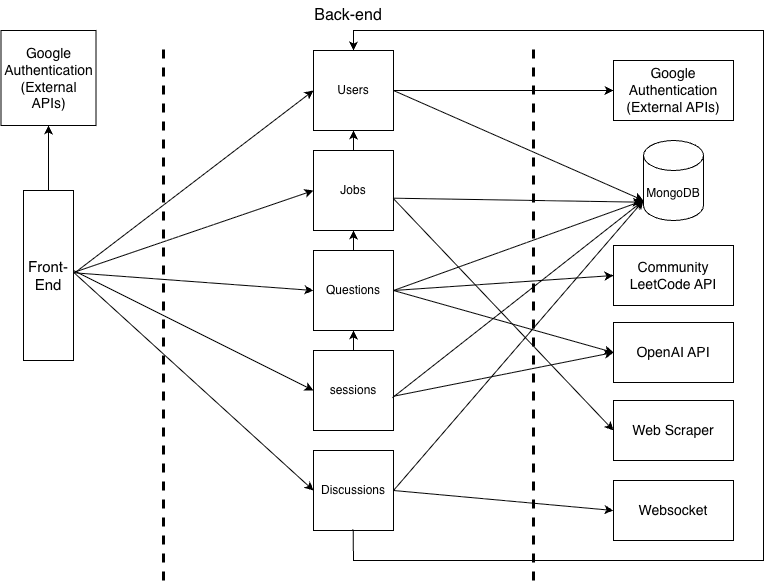

# Requirements and Design

## 1. Change History

| **Change Date**   | **Modified Sections** | **Rationale** |
| ----------------- | --------------------- | ------------- |
| . October 9th 2025| usecase diagram, usecase descriptions. formal use case specifications, backend components, high level design| Changed the use case diagram and the use cases to not have a step by step approach like discussed in lab. Changed the backend components based on separation of concerns and the high level design based on reviewed depdencies with the TA.
| .October 27th 2025| High level design, backend components, NFRs,external modules, features| Added the session component as it simplified coding and provided a better separation of concern. Adding websocket and webscraper to extenrnal modules and to the high level design. Removed the overall progress tracker as it was redundant.|
  .Nove 21 2025 | sequence diagrams | edited the sequence diagrams to be more accuarte to what is actually implemented, changed the interface and the uml features as per the TA's comments.|
  .Nove 28 2025 | sequence diagrams for usecase 4 and the high level design | removed the web socket from high level design and edited the sequence diagram of usecase 4 as per the TA's comments

---

## 2. Project Description

Struggling to find relevant interview questions is a thing of the past. Our AI-powered platform tackles this by taking your uploaded job posting and generating a highly tailored set of practice materials. This includes role-specific coding challenges, system design problems, and behavioral interview questions. To ensure you're interview-ready, you can input and track your progress against these personalized lists, and refine your soft skills with the mock interview, which provides instant feedback to hone your behavioural question delivery.

This comprehensive tool extends beyond just preparation by helping users discover new opportunities and build community. Based on the initial job information provided, the platform intelligently suggests comparable roles, broadening the user's career search and expanding their practice scope. Furthermore, users can engage in peer-to-peer learning by creating or joining discussion groups, allowing them to share recent interview experiences, discuss preparation strategies, and exchange insights with others pursuing similar roles. This integrated approach ensures a personalized, efficient, and collaborative journey toward securing their desired position.

---

## 3. Requirements Specification

### **3.1. List of Features**

#### 1. Authentication
To access app features, a user must Sign In using Google Authentication Service first. New users should Sign Up before Signing In. An authenticated user can Sign Out. Users can also delete their account from the app’s database.

#### 2. Manage job applications
This feature allows users to build a personalized portfolio of job opportunities they're interested in. Users have two options for adding job postings: they can either paste the job posting content directly (copying and pasting the job description text into a text field) or paste a link to the job posting from career websites.

The system stores and organizes these job applications as a searchable, clickable list where each entry displays the job title and company name. Users can view all their saved job applications in this centralized list and must click on a specific job application to use it for generating interview questions. 

#### 3. Generate questions
For each job application, the user can request relevant coding and behavioral questions. Upon request, the app gathers a curated set of interview questions by leveraging a community LeetCode API to gather coding and system design questions tailored to the job description and OpenAI for behavioral questions. The app then displays two options: Technical Questions and Behavioral Questions, which the user can choose from.

Additionally, the app automatically tracks and displays the user's completion progress across each set of generated questions, allowing them to monitor their overall preparation status for that specific job application.

#### 4. Solving technical questions
If the user selects Technical Questions, the app displays a list of relevant coding and system design questions. When the user taps on a question, they are redirected to the appropriate external platform (e.g., LeetCode, HackerRank) where they can practice and solve the problem in a real coding environment. After solving the questions, the user can mark the question as completed which increments their overall technical progress tracker.

#### 5. Mock Interviews
If the user selects Behavioural Questions, the app displays a list of behavioural questions. A user can start a mock interview session for behavioral questions. When the user taps the "Start Mock Interview" button, the app redirects them to a dedicated mock interview screen where the behavioral questions are displayed.

The user can type their answer to each behavioral question. After submitting an answer, the app uses the OpenAI API to analyze the response and provide detailed feedback, then it automatically marks the question as complete.

The user can then end the mock interview or proceed through all the behavioral questions in the mock interview session. Once the session is complete, the app uses the OpenAI API to generate a summary of the user's performance, including feedback for each question and an overall assessment of their responses.

#### 6. Find similar jobs
For each job application, the user can search for similar job postings. Upon request, the app searches for job positions with the same or similar titles currently available on the market. The app then calculates the distance between each job location and the user's location to filter for nearby opportunities, as well as identifies remote positions.

The app displays a curated list of similar job postings. When the user taps on a job posting, the app displays the full job details, including the company name, job description, location, and a link to apply. The user can then choose to save the job posting to their job applications.

#### 7. Manage discussions
A user can create a discussion and provide the discussion topic (e.g., "Amazon SDE Interview" or "Google Behavioral Tips").

Any user can browse a list of active discussions and find discussions relevant to their job search. They will be able to view all discussion chats. Users can post messages to share their interview experiences, ask questions, and engage with others who have applied to similar positions or companies.

### **3.2. Use Case Diagram**

### **3.3. Actors Description**
*   **User (Candidate):** The primary actor who uses the platform to manage job applications, generate tailored interview questions, practice technical and behavioral answers, and participate in discussions.
    
*   **OpenAI API (non-active actor):** External service responsible for generating behavioral interview questions and providing feedback on user responses in mock interviews.
    
*   **Community LeetCode API (non-active actor):** External service that supplies technical coding and system design questions relevant to specific job postings.
    

### **3.4. Use Case Description**
**Feature 1: Authentication**

*   **Sign Up:** A new user authenticates via Google OAuth; the system creates a linked account record.
    
*   **Sign In:** The user signs in with Google OAuth and gains access to protected features.
    
*   **Sign Out:** The user ends the current authenticated session.
    
*   **Remove Account:** The user requests deletion; the system permanently removes their data.
    

**Feature 2: Manage Job Applications**

*   **Paste job posting:** The user pastes job posting text; the system stores title, company, and description.
    
*   **Paste job posting link:** The user saves a URL; the system fetches and normalizes the job posting.
    
*   **View saved job application details:** The user opens a stored job application in their job portfolio.
    
*   **Delete job application:** The user removes an existing job from their portfolio.
    

**Feature 3: Generate Questions**

*   **Generate questions for a saved job:** The system produces behavioral (OpenAI) and technical (LeetCode) sets for the selected job. 
    
*   **Access Technical Questions:** The user opens the technical set for that job.
    
*   **Access Behavioral Questions:** The user opens the behavioral set for that job.
    

**Feature 4: Solving Technical Questions**

*   **Solve a Technical Question:** The user selects a problem to practice then the system redireted the user to the external website that hosts the question (LeetCode).
    
*   **Mark a technical question as complete:** The user marks a question as completed.

    

**Feature 5: Mock Interviews**

*   **Start mock interview:** The user starts a behavioral mock interview session for the selected job.
    
*   **Answer behavioral questions:** The user types an answer into the response box and submits. The system analyzes the answer via OpenAI and returns feedback then marks the question as complete.
    
*   **End/Finish a mock interview:** The user can end the session without completing the set of questios or finish the session my completing the entire set of questions. The system then gives the user feedback and a summary analysis using the OpenAI API.
    

**Feature 6: Find Similar Jobs**

*   **Search for similar and close-by jobs:** The systme generates a list of similar jobs in terms of duties and positions and proximity to the job application chosen by the user. It will also include similar postions that are completly remote.
    
*   **View a similar and close-by job:** The user opens a posting to view the found job posting details.
    
*   **Save a similar and close-by job:** The user adds the viewed similar job posting to their portfolio.
    

**Feature 7: Manage Discussions**

*   **Browse existing discussions:** User can view and search through available discussion topics related to job interviews and career preparation.
    
*   **Create a discussion:** User can start a new discussion topic (e.g., "Amazon SDE Interview Tips") to connect with others preparing for similar interviews.
    
*   **View a discussion:** User can open and read all messages within a specific discussion thread to learn from others' experiences.
    
*   **Post in a discussion:** User can share their own interview experiences, ask questions, or provide advice by posting messages in relevant discussions.

  
### **3.5. Formal Use Case Specifications (5 Most Major Use Cases)**

#### Use Case 1: Generate Questions for a Saved Job 

**Description**: User selects a saved job application and requests tailored interview questions (behavioral and technical) for the selected job application.

**Primary actor(s)**: User, OpenAI API, Community LeetCode API

**Preconditions:** 
- User is authenticated and logged into the system
- User has at least one saved job application in their portfolio

**Post-conditions:** 
- User can access tailored behavioral and coding questions for the selected job application
- Questions are stored and available for future practice sessions

    
**Main success scenario**:
1. User navigates to their job applications list
2. User selects a saved job application
3. User clicks on "Generate Questions" button
4. System obtains saved job description details
5. System calls OpenAI API and LeetCode API to generate behavioural and technical questions.
6. System processes and stores the generated questions
7. System displays two options: "Behavioral Questions" and "Technical Questions" buttons
8. User can click either button to view the respective list of generated questions

**Failure scenario(s)**:

- 4a. No job description content available:
    - 4a1. System displays error message: "Unable to generate questions. Job description is missing or incomplete."
    - 4a2. System continues showing the saved job appliaction screen. 

- 5a. OpenAI API failure:
    - 5a1. System displays error message: "Unable to generate behavioral questions at this time. Please try again later."
    - 5a2. System continues to step 6 to attempt coding questions generation.
    - 5a3. No "Behavioural Questions" button will be available in step 8.

- 5b. OpenAI API returns no behavioral questions:
    - 5b1. System displays warning: "No behavioral questions could be generated for this job type."
    - 5b2. System continues to step 6 to attempt coding questions generation.
    - 5b3. No "Behavioural Questions" button will be available in step 8.

- 5c. Community LeetCode API failure:
    - 5c1. System displays error message: "Unable to generate coding questions at this time."
    - 5c2. No "Technical Questions" button will be available in step 8.

- 5d. LeetCode API returns no coding questions:
    - 5d1. System displays warning: "No relevant coding questions found for this job type."
    - 5d2. No "Technical Questions" button will be available in step 8.
    
- 6a. Question processing failure:
    - 6a1. System displays error message: "Questions generated but could not be processed. Please try again later."

#### Use Case 2: Solve a Technical Question  

**Description**: User accesses and solves a technical coding question by being redirected to external coding platforms, then user can mark the question as complete to track progress.

**Primary actor(s)**: User  

**Preconditions:** 
- User is authenticated and logged in 
- User has generated technical questions for a job application
- Technical questions list is displayed to the user

**Post-conditions:**  
- User is redirected to external coding platform to solve the problem
- User can return back to the app and mark the question as complete

**Main success scenario**:  
1. User navigates to the list of technical questions for a selected job application
2. User clicks to solve a specific technical question
3. System retrieves the stored problem URL for the selected question
4. System opens the external coding platform URL in a browser tab/window
5. User solves the problem on the external platform

**Failure scenario(s)**:  
- 1a. Technical questions list fails to load:
    - 1a1. System displays error message: "Unable to load technical questions. Please try again."

- 2a. Question selection fails:
    - 2a1. System displays error message: "Unable to select question. Please refresh and try again."

- 3a. Problem URL is missing or corrupted:
    - 3a1. System displays error message: "Problem link not available for this question."
    - 3a2. User returns to questions list

- 4b. Browser fails to open new tab:
    - 4b1. System displays error message: "Unable to redirect. Please copy the link and open manually."
    - 4b2. System provides clickable link as fallback

---

#### Use Case 3: Start Mock Interview 

**Description**: User initiates a mock interview session for the generated behavioral questions, progressing through questions with AI-powered feedback and performance tracking.

**Primary actor(s)**: User  

**Secondary actor(s)**: OpenAI API  

**Preconditions:**  
- User is authenticated and logged in
- User has generated behavioral questions for a selected job application
- Behavioral questions are available and stored in the system

**Post-conditions:**  
- Mock interview session is active with the first question displayed
- User can proceed through questions and receive feedback

**Main success scenario**:  
1. User navigates to behavioral questions for a selected job application
2. User clicks on "Start Mock Interview" button
3. System retrieves the stored behavioral questions for the selected job
4. System initializes mock interview session interface
5. System displays the first behavioral question to the user
6. User can begin answering questions and receiving feedback

**Failure scenario(s)**:  
- 1a. Behavioral questions list fails to load:
    - 1a1. System displays error message: "Unable to load behavioral questions. Please try again."

- 3b. Question retrieval from storage fails:
    - 3b1. System displays error message: "Unable to retrieve questions. Please try generating questions again."

- 4b. Session interface fails to load:
    - 4b1. System displays error message: "Interview interface could not load. Please refresh and try again."

- 5b. OpenAI API connection fails during session setup:
    - 5b1. System displays error message: "Interview feedback service unavailable. Please try again later."

---

#### Use Case 4: Find Similar and Close-by jobs 

**Description:** User selects a saved job describtion and requests similar job postings that have similar titles and duties to their saved job, the simialr jobs are filtered by proximity to the original job location and include remote opportunities.

**Primary Actors:** User  

**Preconditions:** 
- User is authenticated and logged into the system
- User has at least one saved job application

**Post-conditions:** 
- User receives a curated list of similar job postings
- User can view job details and save interesting positions to their saved job applications

**Main Success Scenario:**
1. User clicks on "Find Similar Jobs" button for their selected job
3. System retrieves saved job title, key requirements, and location from the selected application
4. System searches external job sites for similar positions
5. System filters results for opportunities near the original job location or remote positions
6. System displays a curated list of similar job postings with location information relative to original job
7. User taps on redirect button to be redirected to job posting's website
8. User can choose to save the job posting to their saved job applications

**Failure scenario(s)**:
- 3b. Original job location is unavailable:
    - 4b1. System displays warning: "Original job location not found. Showing all similar positions without location filtering."
    - 4b2. System continues without location-based filtering

- 4a. No similar jobs found:
    - 5a1. System displays error message: "No similar jobs found. Check back later"
    - 5a2. The use case terminates unsuccessfully and the system just shows the current saved job description screen.

- 6a. No similar jobs found after location filtration:
    - 7a1. System displays message: "No similar job postings found near the original job location. Check back later."
    - 7a2. The use case terminates unsuccessfully and the system just shows the current saved job description screen.

- 8a. Duplicate job posting detected:
    - 9a1. System displays warning: "This job posting is already in your applications."
    - 9a2. User can continue browsing other results

----

#### Use Case 5: Create Discussion  

**Description**: User creates a new discussion and enters the topic of the discussion. This created discussion is then available for all users to browse, view and post in.

**Primary actor(s)**: User  

**Preconditions:**  
- User is authenticated and logged into the system

**Post-conditions:**  
- New discussion topic is created and stored in the system
- Discussion is available for other users to browse and join
- User can post messages in the newly created discussion

**Main success scenario**:  
1. User navigates to the discussions section
2. User clicks on "Create Discussion" button
3. System displays discussion creation form
4. User enters discussion topic title (e.g., "Amazon SDE Interview Tips")
5. User optionally adds an initial description or message
6. User clicks "Create Discussion" to submit
7. System stores the discussion
8. System redirects user to the newly created discussion page
9. User can begin posting messages in the discussion

**Failure scenario(s)**:  
- 4a. User submits empty discussion topic:
    - 4a1. System displays validation error: "Discussion topic is required. Please enter a topic title."
    - 4a2. User remains on creation form to provide input

- 4b. Discussion topic exceeds character limit:
    - 4b1. System displays validation error: "Topic title is too long. Please keep it under 100 characters."
    - 4b2. User can edit the topic title

- 5a. Initial description exceeds character limit:
    - 5a1. System displays validation error: "Description is too long. Please keep it under 500 characters."
    - 5a2. User can edit the description

---

### **3.7. Non-Functional Requirements**

**NFR-1: API Response Time**

*   **Requirement:** All backend API endpoints must respond with a **p95 response time ≤ 3 seconds** under normal load conditions (≤ 100 concurrent requests across all endpoints).

    
*   **Why it matters:** Users interact with multiple features during interview prep; consistently fast response times across the entire system ensure a smooth user experience regardless of which feature they use.

**NFR-2: System Scalability**

*   **Requirement:** The system must support **at least 50 concurrent users** performing mixed operations (job management, question generation, discussion participation) with **≤ 5% request failure rate** and maintaining response times within NFR-1 limits.

    
*   **Why it matters:** The application must handle multiple simultaneous users across all features without degradation; poor scalability leads to failures during peak usage times when students are actively preparing.

**NFR-3: Data Integrity and Consistency**

*   **Requirement:** The system must maintain **100% data consistency** across all CRUD operations with **zero data loss** during concurrent access. Specifically: (1) All created jobs, questions, and discussions must be successfully stored and retrievable, (2) Question completion status updates must be atomic and accurately reflected, (3) Concurrent message posts to the same discussion must all be saved without overwriting.
    
    
*   **Why it matters:** Users trust the system to accurately track their interview preparation progress; data loss or inconsistency (e.g., losing completed questions, missing discussion messages) severely damages user trust and application usefulness.

----  
    
### 4.1. Main Components
###

#### **4.1 Component Interfaces**

##### **Users**
- **Purpose:** Manage user authentication, profiles, and user-specific data access
- **Rationale:** Handles all user-related operations and maintains user session state

**External Interface (Frontend ↔ Backend):**
  - `POST /auth/signin(GoogleLoginRequest{idToken})` → `AuthData{userId, name, email, token}` - Authenticate user with Google OAuth token and return session credentials
  - `POST /auth/signup(GoogleLoginRequest{idToken})` → `AuthData{userId, name, email, token}` - Register new user with Google OAuth and create profile
  - `GET /user/profile()` → `UserProfile{userId, name, email, createdAt}` - Retrieve authenticated user's profile information
  - `POST /user/profile(UpdateProfileRequest{name?, email?})` → `UserProfile` - Update user profile details (name, email)
  - `DELETE /user/profile(DeleteProfileRequest{password})` → `Unit` - Permanently delete user account and all associated data

**Internal Interface (Used by other Backend Components):**
  - `userModel.findById(userId: String)` → `User{_id, name, email, ...}` - Retrieve user details by ID (used by Discussions, Sessions, Questions for displaying user info)
  - `userModel.create(userData: UserData)` → `User` - Create new user record in database (used during authentication)

---

##### **Jobs**
- **Purpose:** Handle job application management - adding, storing, viewing, and organizing user's saved job postings
- **Rationale:** Centralizes all job-related data operations and provides foundation for question generation

**External Interface (Frontend ↔ Backend):**
  - `POST /jobs(CreateJobApplicationRequest{title, company, description, location?, url?, salary?, jobType?, experienceLevel?})` → `JobApplication{id, userId, ...}` - Create new job application entry
  - `GET /jobs(page, limit)` → `JobApplicationsListResponse{jobApplications, total}` - Retrieve paginated list of user's saved job applications
  - `GET /jobs/{id}()` → `JobApplication` - Get detailed information for specific job application
  - `PUT /jobs/{id}(UpdateJobApplicationRequest{title?, company?, description?, ...})` → `JobApplication` - Update existing job application details
  - `DELETE /jobs/{id}()` → `Unit` - Remove job application from user's saved jobs
  - `GET /jobs/search(query, page, limit)` → `JobApplicationsListResponse{jobApplications, total}` - Search user's jobs by text (title, company, description)
  - `GET /jobs/by-company(company, page, limit)` → `JobApplicationsListResponse{jobApplications, total}` - Filter jobs by company name
  - `GET /jobs/statistics()` → `JobStatistics{totalApplications, topCompanies, totalCompanies}` - Get user's job application statistics and insights
  - `POST /jobs/scrape(ScrapeJobRequest{url})` → `ScrapedJobDetails{title, company, description, location, salary, ...}` - Extract job details from external career site URL using web scraper
  - `POST /jobs/{id}/similar(SimilarJobsRequest{radius?, remote?, limit?})` → `SimilarJobsResponse{similarJobs, total}` - Find similar job postings based on saved job using web scraping and title/location matching

**Internal Interface (Used by other Backend Components):**
  - `jobApplicationModel.findById(jobId: ObjectId, userId: ObjectId)` → `JobApplication{title, company, description, ...}` - Retrieve job details by ID (used by Questions to get job description for question generation)
  - `jobApplicationModel.findByUserId(userId: ObjectId, limit: Number, skip: Number)` → `{jobApplications: JobApplication[], total: Number}` - Get all jobs for a user (used by Sessions to list available jobs)

---

##### **Questions**
- **Purpose:** Generate, store, and retrieve technical and behavioral interview questions for specific job applications
- **Rationale:** Encapsulates question generation logic and manages question lifecycle

**External Interface (Frontend ↔ Backend):**
  - `POST /questions/generate(GenerateQuestionsRequest{jobId, types: [BEHAVIORAL, TECHNICAL], count})` → `GenerateQuestionsResponse{behavioralQuestions, technicalQuestions, totalQuestions}` - Generate interview questions using OpenAI API (behavioral) and LeetCode API (technical) based on job description
  - `POST /questions/generateQuestions(GenerateQuestionsFromDescriptionRequest{jobDescription, jobId})` → `GenerateQuestionsFromDescriptionResponse{success, data, storedQuestions}` - Alternative generation endpoint that takes job description directly and generates technical questions from LeetCode API
  - `GET /questions/job/{jobId}(type?)` → `GenerateQuestionsResponse{behavioralQuestions, technicalQuestions, totalQuestions, jobApplication}` - Retrieve all questions or filter by type (BEHAVIORAL or TECHNICAL) for specific job
  - `GET /questions/job/{jobId}/progress()` → `QuestionProgressResponse{technical, behavioral, overall}` - Get completion statistics for job's questions (total, completed counts)
  - `GET /questions/{questionId}()` → `BehavioralQuestion{id, title, description, tags, status, ...}` - Retrieve single behavioral question details by ID
  - `PUT /questions/{questionId}/answer(SubmitAnswerRequest{questionId, answer, questionType})` → `SubmitAnswerResponse{feedback, score, strengths, improvements}` - Submit answer for behavioral question and receive AI-generated feedback from OpenAI
  - `PUT /questions/{questionId}/toggle()` → `GenerateQuestionsResponse{...updatedQuestions}` - Mark question as completed or incomplete, tracking user progress
  - `DELETE /questions/{questionId}()` → `Unit` - Delete specific question from job's question list
  - `GET /questions/categories()` → `List<QuestionCategory>` - Retrieve available question categories for filtering
  - `GET /questions/difficulties()` → `List<QuestionDifficulty>` - Retrieve available difficulty levels (EASY, MEDIUM, HARD)

**Internal Interface (Used by other Backend Components):**
  - `questionModel.findByJobAndType(jobId: ObjectId, userId: ObjectId, type?: QuestionType)` → `Question[]` - Retrieve questions for a job, optionally filtered by type (used by Sessions to get questions for mock interviews)
  - `questionModel.createMany(userId: ObjectId, jobId: ObjectId, questions: QuestionData[])` → `Question[]` - Bulk create questions (used internally during generation)
  - `questionModel.updateStatus(questionId: ObjectId, userId: ObjectId, status: QuestionStatus)` → `Question` - Update question completion status (used by Sessions when user completes questions)

---

##### **Discussions**
- **Purpose:** Handle discussion forum creation, management, and user participation
- **Rationale:** Manages community features separate from individual practice components

**External Interface (Frontend ↔ Backend):**
  - `GET /discussions(search?, sortBy, page, limit)` → `DiscussionListResponse{discussions, pagination}` - Retrieve all public discussions with search and sorting (recent/popular), shows discussions from all users
  - `GET /discussions/{id}()` → `DiscussionDetailResponse{id, topic, description, creatorId, creatorName, messages, messageCount, ...}` - Get specific discussion with all messages and participant info
  - `POST /discussions(CreateDiscussionRequest{topic, description?})` → `CreateDiscussionResponse{success, discussionId}` - Create new discussion thread, broadcasts to all users via WebSocket
  - `POST /discussions/{id}/messages(PostMessageRequest{content})` → `PostMessageResponse{message}` - Post message to discussion, notifies participants in real-time via WebSocket
  - `GET /discussions/my/discussions(page, limit)` → `DiscussionListResponse{discussions, pagination}` - Get discussions created by authenticated user only

**Internal Interface (Used by other Backend Components):**
  - `discussionModel.findById(discussionId: String)` → `Discussion{_id, topic, messages, userId, ...}` - Retrieve discussion details (used internally for validation)
  - `discussionModel.create(userId: String, userName: String, topic: String, description?: String)` → `Discussion` - Create new discussion (called by controller)
  - `discussionModel.postMessage(discussionId: String, userId: String, userName: String, content: String)` → `Discussion` - Add message to discussion (called by controller)

---

##### **Sessions**
- **Purpose:** Handle mock interview session lifecycle, including creation, question navigation, answer submission, and session state management
- **Rationale:** Manages interview practice sessions separate from question generation, tracking user progress through behavioral questions and coordinating with OpenAI for real-time feedback

**External Interface (Frontend ↔ Backend):**
  - `POST /sessions/create(CreateSessionRequest{jobId})` → `CreateSessionResponse{sessionId, jobId, status}` - Initialize new mock interview session with behavioral questions from specified job
  - `GET /sessions/{sessionId}()` → `SessionResponse{sessionId, currentQuestion, questionsAnswered, totalQuestions, status, ...}` - Retrieve active session details including current question and progress
  - `GET /sessions(limit)` → `UserSessionsResponse{sessions, total}` - Get user's session history with pagination
  - `POST /sessions/submit-answer(SubmitAnswerRequest{sessionId, questionId, answer})` → `SubmitAnswerResponse{feedback, score, nextQuestion}` - Submit answer for current question, receive AI-generated feedback from OpenAI, and get next question
  - `PUT /sessions/{sessionId}/navigate(NavigateRequest{direction})` → `SessionResponse{...updatedSession}` - Move to next/previous question in session
  - `PUT /sessions/{sessionId}/status(UpdateStatusRequest{status})` → `SessionResponse{...updatedSession}` - Update session state (active/completed/cancelled)
  - `GET /sessions/{sessionId}/progress()` → `SessionProgressResponse{questionsAnswered, totalQuestions, averageScore, completionPercentage}` - Get current progress statistics
  - `DELETE /sessions/{sessionId}()` → `Unit` - Delete/cancel session and remove from history

**Internal Interface (Used by other Backend Components):**
  - `sessionModel.findActiveByJobId(jobId: ObjectId, userId: ObjectId)` → `Session | null` - Check if user has active session for job (used by Questions to prevent question regeneration during active session)
  - `sessionModel.create(userId: ObjectId, jobId: ObjectId, questionIds: ObjectId[])` → `Session` - Create new session (called by controller)

    
    * * *
    
    ### 4.2. Databases
    
    ### 
    
    *   **MongoDB** (NoSQL database) in a larger scale project we would have used multiple databases for separation of concerns; however, to reduce overhead we will only be using one with multiple collections.

        
    
    Collections:

    1. **users**
        - **Purpose:** Store user authentication info, profile data, and ownership of content.

    2. **jobApplications** (or **jobs**)
        - **Purpose:** Store user's saved job applications, including title, company, location, description, skills, status, and application dates.

    3. **questions**
        - **Purpose:** Store generated technical and behavioral questions for each job, with status (pending, completed), difficulty, tags, and external URLs.

    4. **sessions**
        - **Purpose:** Track active mock interview sessions, including current question index, answers, progress, and session state (active/completed/cancelled).

    5. **discussions**
        - **Purpose:** Contain discussion metadata (topic, description, creator) AND embedded messages array (not a separate collection).
        - **Structure:** Each discussion document contains `messages[]` subdocuments with userId, userName, content, timestamps.
    

    6. **availableJobs**
        - **Purpose:** Store scraped job postings from external sources (Indeed, LinkedIn, etc.) for similar job search functionality.
     

    * * *
    
    ### 4.3. External Modules
    
    ### 
    
    1. **Community LeetCode API**
        
        *   **Purpose:** Retrieve coding and system design questions relevant to job postings.
            
    2. **Google OAuth API**
        
        *   **Purpose:** Manage user authentication and sign-in with Google accounts.
            
    3. **OpenAI API**
        
        *   **Purpose:** Generate behavioral interview questions from job descriptions and provide feedback on user answers.
    
    4. **Web Scraper (Puppeteer/Cheerio)**

        *   **Purpose:** Extract job postings from external career sites (Indeed, LinkedIn, Glassdoor, RemoteOK, Stack Overflow Jobs, GitHub Jobs) to provide similar job recommendations. Scrapes job titles, descriptions, locations, salaries, and requirements from multiple sources to expand job search beyond manually entered applications.

            
            
    
    * * *
    
    ### 4.4. Frameworks
    
    ### 
    
    1. **Express.js**
        
        *   **Purpose:** Backend framework for API routing and business logic.
            
        *   **Reason:** Lightweight, scalable, and familiar to the development team.
            
    2. **Azure VM**
        
        *   **Purpose:** Host backend services and database in the cloud.
            
        *   **Reason:** Strong support for scalability and the team’s prior experience.

### **4.5. Dependencies Diagram**

**Note:**
- currenlty for the mvp each job is owned or stored by a user as a job model requires a user id; hence the dependency. However for scalability we might be changing that in later milestones.
- We decided to keep the sessions (even though in the lab we said we wouldn't) because it was simpler to code as it provided more separation of concerns.

### **4.6. Use Case Sequence Diagram (5 Most Major Use Cases)**
#### **Use Case 1: Generate Questions for a Saved Job**

#### **Use Case 2: Solve a Technical Question**

#### **Use Case 3: Start Mock Interview**

#### **Use Case 4: Find Similar and Close-by jobs**

#### **Use Case 5: Create Discussion**

### **4.7. Design and Ways to Test Non-Functional Requirements**

**NFR-1: API Response Time**  
**Validation:**

*   Load-test all major endpoints (`POST /questions/generate`, `GET /jobs`, `POST /discussions`, `PUT /questions/{id}/toggle`) with 100 concurrent users using **k6/JMeter/Locust**: ramp 2 min → steady 10 min. Pass if **p95 ≤ 3s** for all endpoints and overall error rate < 1%.
    
*   Measure individual endpoint latency under normal load (10 concurrent users) for 5 minutes. Pass if lightweight endpoints (`GET /jobs`, `GET /discussions`) achieve **p95 ≤ 500ms** and heavy endpoints (`POST /questions/generate`) achieve **p95 ≤ 8s**.
    
*   Monitor backend logs and APM tools (Azure Application Insights/New Relic) during load tests. Pass if database query times remain **< 200ms p95** and external API calls (OpenAI/LeetCode) are properly timeout-handled.

* * *

**NFR-2: System Scalability**  
**Validation:**

*   Concurrent user simulation with **Locust/k6**: simulate 50 virtual users executing mixed realistic workflows (login → create job → generate questions → browse discussions → post message) continuously for 15 minutes. Pass if **error rate ≤ 5%**, **p95 response time ≤ 3s**, and **zero server crashes**.
    
*   Resource monitoring during load test: track CPU usage, memory consumption, database connection pool utilization, and network I/O using monitoring tools (Docker stats, Azure Monitor, Grafana). Pass if **CPU < 80%**, **memory < 85%**, **DB connections < 80% of pool limit**.
    
*   Stress test beyond capacity: gradually increase concurrent users from 50 → 100 → 150 until system degrades. Pass if system handles **at least 50 users** gracefully and provides **clear degradation signals** (503 responses, queue full messages) rather than silent failures when overloaded.

* * *

**NFR-3: Data Integrity and Consistency**  
**Validation:**

*   CRUD consistency tests using **automated integration tests (Jest/JUnit/Pytest)**: Create 100 jobs, 100 questions, and 50 discussions via API calls. Retrieve all records and verify **100% match** (no missing data, correct attributes). Pass if **zero data loss** across 10 test runs.
    
*   Concurrency race condition tests: Simulate 20 concurrent users toggling the same question's completion status 50 times each (total 1000 toggles). Verify final state matches expected count. Simulate 50 concurrent users posting messages to the same discussion simultaneously. Pass if **all 50 messages saved** with correct timestamps and **no overwrites/corruption**.
    
*   Database integrity checks: Run MongoDB validation commands (`db.collection.validate()`) on all collections after load tests and concurrent operations. Query for orphaned records (questions without jobs, messages without discussions). Pass if **zero orphaned records** and **all foreign key relationships intact**.
    
*   Transaction rollback tests: Simulate failures during multi-step operations (e.g., create job + generate questions). Force failures midway and verify **atomic rollback** (no partial data). Pass if database remains consistent with **no incomplete transactions**.

